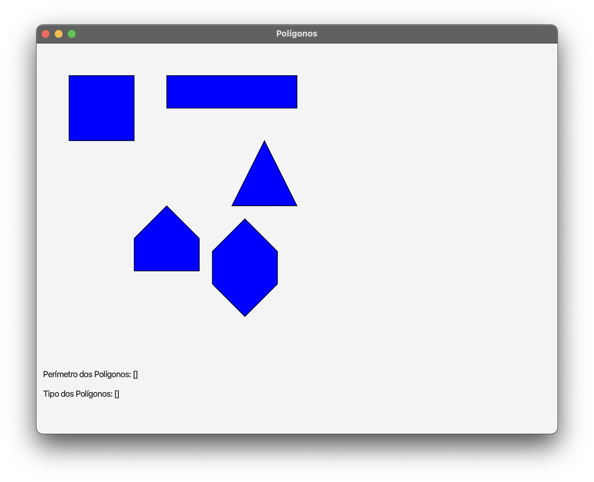

# Utilizando Stream.flatMap para processar uma lista de pontos de vários polígonos

Este projeto implementa uma aplicação desktop multiplataforma utilizando a biblioteca [OpenJFX](https://openjfx.io) de Java e desenha polígonos na tela.
O objeto do projeto não é ensinar a usar o JavaFX, mas sim treinar o uso de `Stream.flatMap` para processar uma lista de pontos de vários polígonos usando programação funcional.

Assim, você pode ignorar todo o código da aplicação e focar apenas nos atributos e nos métodos que possuem um comentário `TODO`, que são os 2 últimos métodos na classe [PoligonosApp](src/main/java/com/example/PoligonosApp.java).

## 1. Como usar o projeto para executar as atividades a serem propostas abaixo

Você deve criar uma cópia deste repositório clicando no botão "Fork" no canto superior direito da página.

**O botão só aparece se você estiver logado no GitHub.**

## 2. Pré-requisitos para rodar o projeto

Você precisa ter o JDK 17 ou superior para compilar e executar a aplicação.

## 3. Rodando o projeto

Para rodar o projeto, clique no botão "Run" no IntelliJ (talvez você precise escolher uma opção na lista do lado esquerdo do botão).

Você também pode abrir um terminal na raiz do projeto e executar um dos comandos abaixo.

No Windows:

```bash
 mvnw.cmd javafx:run
```

No Linux/macOS:

```bash
 ./mvnw javafx:run
```

Ao iniciar, você verá uma tela como abaixo, onde são desenhados vários polígonos a partir de uma lista de pontos (coordenadas x,y), definidas no atributo `pontosPoligonos` da classe  [PoligonosApp](src/main/java/com/example/PoligonosApp.java).

## 4. Tarefas a serem implementadas

Sua tarefa principal é implementar as funções para:

- calcular o perímetro (soma da distância entre todos os pontos) de um polígono;
- indicar qual o tipo de cada polígono (quadrilátero, triângulo, pentágono, etc).



Por fim, você deve analisar o método `start` da classe [PoligonosApp](src/main/java/com/example/PoligonosApp.java), verificar que recursos de programação funcional podem ser usados nele e fazer as devidas alterações. O que poderia ser melhorado no código de tal método? Faça tais alterações.

## 5. Testando sua implementação das funções

Para confirmar que você implementou todas as tarefas e fez como deveria, execute os testes por meio do seu IDE. No IntelliJ, por exemplo, você pode clicar com o botão direito no nome do projeto na barra lateral esquerda e escolher "Run All Tests".

Ou faça isso pelo terminal, executando um dos comandos abaixo.

No Windows:
```bash
mvnw.cmd test
```

No Linux/macOS:
```bash
./mvnw test
```

Se não aparecer nenhum erro nem mensagem em vermelho, seu código tá pronto.

## 6. Detalhes sobre a modelagem do projeto

Observe que estamos definindo uma lista de pontos de cada polígono no atributo `pontosPoligonos` da classe mencionada. Mas o polígono em si é representado pela classe `Polygon` do pacote `javafx.scene.shape` da biblioteca OpenJFX.
Tal classe não possui implementação das operações de cálculo de perímetro e identificação do tipo de um polígono. Assim, nós temos que implementar tais operações.

Em um projeto real, você poderia criar uma classe `Poligono` que estendesse `Polygon` e encapsulasse a implementação dos métodos `perimetro` e `tipo`. 
Como iríamos então calcular o perímetro e descobrir o tipo de cada polígono individualmente, não precisaríamos de `Stream.flatMap`, apenas de outros métodos de `Stream`, o que tornaria o código mais simples.

Encapsulamento é um conceito crucial de orientação a objetos. Apesar de estarmos usando POO e programação funcional, POO não é o foco deste projeto. Aqui, queremos treinar o uso de `Stream.flatMap` para processar uma lista de pontos de vários polígonos e por isso não iremos encapsular os métodos indicados em uma nova classe.

Mas de qualquer maneira, você poderia simplesmente ter recebido os dados como do atributo `pontosPoligonos` de outro método ou API (que representasse qualquer outra coisa que não um objeto gráfico como um polígono) e precisasse processar esses dados com `Stream.flatMap`. Aqui usei os pontos de polígonos como fonte de dados pois é fácil de visualizar e entender.
